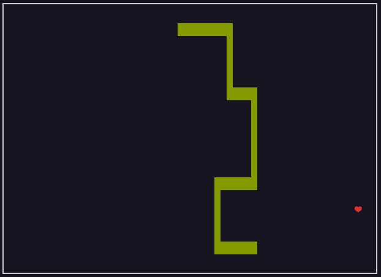

# Cnake

Snake in your terminal. In C, no dependencies.



## Usage

Run `make` to compile.

```
make
```

Alternatively, invoke your compiler of choice directly:

```
cc cnake.c -O2 -o cnake
```

Then run `cnake` from your terminal to start the game.

### Controls

- `wasd` to change direction.
- `+` or `-` to in- or decrease the snake's speed.
- `ESC` or `Ctrl+C` to quit.

## Related resources

- everything you ever wanted to know about terminals, https://xn--rpa.cc/irl/term.html
- ANSI escape codes, https://en.wikipedia.org/wiki/ANSI_escape_code

## License

[UNLICENSE](LICENSE)
